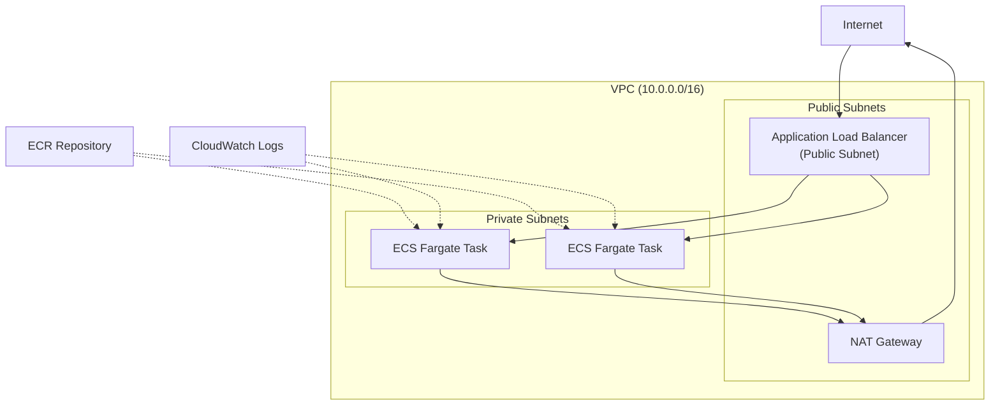
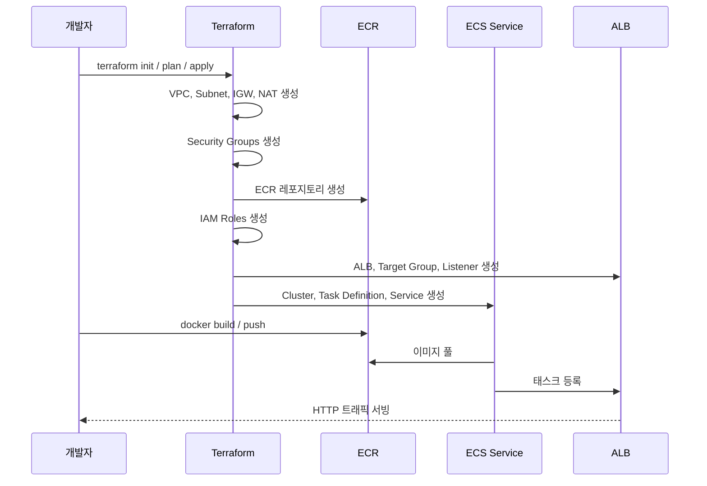

# AWS ECS Fargate Terraform 배포 가이드

## 기술 개요

### 왜 Fargate인가?

- EC2 인스턴스 관리가 불필요 (패치, 스케일링, AMI 관리 등 제거)
- 컨테이너 단위 과금으로 비용 최적화
- 웹 API 워크로드에 가장 적합한 서버리스 선택

### 아키텍처 다이어그램



### 핵심 AWS 리소스

| 리소스 | 설명 |
|--------|------|
| **VPC** | 퍼블릭/프라이빗 서브넷, NAT Gateway, Internet Gateway |
| **ECR** | Docker 이미지 저장소 |
| **ECS Cluster** | Fargate 기반 클러스터 |
| **ECS Task Definition** | 컨테이너 사양 정의 (CPU, 메모리, 포트, 환경변수) |
| **ECS Service** | 태스크 실행/유지, Auto Scaling 설정 |
| **ALB** | 외부 트래픽 수신 및 태스크로 분산 |
| **Security Groups** | ALB(80/443) → ECS(앱포트) 간 트래픽 제어 |
| **IAM Roles** | ECS Task Execution Role, Task Role |
| **CloudWatch** | 로그 그룹 및 메트릭 |

---

## Terraform 파일 구조

```
terraform/
  main.tf            # Provider 설정, 로컬 변수
  variables.tf       # 입력 변수 정의
  outputs.tf         # 출력값 정의
  vpc.tf             # VPC, 서브넷, IGW, NAT, 라우팅 테이블
  security_groups.tf # ALB용, ECS용 Security Group
  alb.tf             # ALB, Target Group, Listener
  ecr.tf             # ECR 레포지토리
  iam.tf             # ECS 실행 역할, 태스크 역할
  ecs.tf             # ECS 클러스터, 태스크 정의, 서비스
  autoscaling.tf     # ECS 서비스 Auto Scaling 정책
  cloudwatch.tf      # CloudWatch 로그 그룹
  terraform.tfvars   # 변수 값 설정 (예시)
```

---

## 각 파일별 주요 내용

### 1. `main.tf` — Provider 및 기본 설정

- AWS Provider, 리전 설정
- Terraform backend 설정 (S3 등, 선택사항)
- 기본 태그 로컬 변수

### 2. `variables.tf` — 변수 정의

| 변수 | 설명 | 기본값 |
|------|------|--------|
| `aws_region` | AWS 리전 | `ap-northeast-2` |
| `app_name` | 애플리케이션 이름 | — |
| `environment` | 배포 환경 | `dev` |
| `container_port` | 앱 수신 포트 | `8080` |
| `container_image` | 초기 이미지 URI | `nginx:latest` |
| `task_cpu` | Fargate CPU | `256` |
| `task_memory` | Fargate 메모리 (MiB) | `512` |
| `desired_count` | 태스크 수 | `2` |
| `vpc_cidr` | VPC CIDR 블록 | `10.0.0.0/16` |
| `availability_zones` | 가용 영역 | `[ap-northeast-2a, 2c]` |

### 3. `vpc.tf` — 네트워크

- VPC (`10.0.0.0/16`)
- 퍼블릭 서브넷 2개 (`10.0.1.0/24`, `10.0.2.0/24`) — ALB 배치
- 프라이빗 서브넷 2개 (`10.0.11.0/24`, `10.0.12.0/24`) — ECS 태스크 배치
- Internet Gateway, NAT Gateway (프라이빗 서브넷에서 외부 접속용)
- 각 서브넷별 라우팅 테이블

### 4. `security_groups.tf`

- **ALB SG**: 인바운드 80, 443 허용
- **ECS SG**: ALB SG에서 오는 `container_port` 트래픽만 허용

### 5. `alb.tf`

- `aws_lb` — application type, 퍼블릭 서브넷 배치
- `aws_lb_target_group` — `target_type = "ip"`, 헬스체크 설정
- `aws_lb_listener` — 80 → Target Group 포워딩

### 6. `ecr.tf`

- `aws_ecr_repository` — 이미지 스캔 활성화, 라이프사이클 정책 (최근 20개 이미지 유지)

### 7. `iam.tf`

- **Task Execution Role**: ECR 이미지 풀, CloudWatch 로그 쓰기 권한
- **Task Role**: 앱이 런타임에 사용할 AWS 서비스 접근 권한 (필요시)

### 8. `ecs.tf` — 핵심 리소스

```hcl
resource "aws_ecs_cluster" "main" {
  name = "${var.app_name}-${var.environment}"
  setting {
    name  = "containerInsights"
    value = "enabled"
  }
}

resource "aws_ecs_task_definition" "app" {
  family                   = "${var.app_name}-${var.environment}"
  network_mode             = "awsvpc"
  requires_compatibilities = ["FARGATE"]
  cpu                      = var.task_cpu
  memory                   = var.task_memory
  execution_role_arn       = aws_iam_role.ecs_execution.arn
  task_role_arn            = aws_iam_role.ecs_task.arn

  container_definitions = jsonencode([{
    name      = var.app_name
    image     = var.container_image
    essential = true
    portMappings = [{
      containerPort = var.container_port
      protocol      = "tcp"
    }]
    logConfiguration = {
      logDriver = "awslogs"
      options = {
        "awslogs-group"         = aws_cloudwatch_log_group.app.name
        "awslogs-region"        = var.aws_region
        "awslogs-stream-prefix" = "ecs"
      }
    }
  }])
}

resource "aws_ecs_service" "app" {
  name            = "${var.app_name}-${var.environment}"
  cluster         = aws_ecs_cluster.main.id
  task_definition = aws_ecs_task_definition.app.arn
  desired_count   = var.desired_count
  launch_type     = "FARGATE"

  network_configuration {
    subnets          = aws_subnet.private[*].id
    security_groups  = [aws_security_group.ecs.id]
    assign_public_ip = false
  }

  load_balancer {
    target_group_arn = aws_lb_target_group.app.arn
    container_name   = var.app_name
    container_port   = var.container_port
  }
}
```

### 9. `autoscaling.tf`

- `aws_appautoscaling_target` — ECS 서비스 대상 (최소 2, 최대 10)
- `aws_appautoscaling_policy` — CPU/메모리 기반 Target Tracking 정책 (목표 70%)

### 10. `outputs.tf`

- ALB DNS 이름 (접속 URL)
- ECR 레포지토리 URL
- ECS 클러스터 이름, 서비스 이름

---

## 배포 흐름



---

## 사용 방법

```bash
cd terraform
terraform init
terraform plan
terraform apply
```

적용 후 Docker 이미지를 ECR에 푸시:

```bash
aws ecr get-login-password --region ap-northeast-2 | \
  docker login --username AWS --password-stdin <ECR_URL>

docker build -t my-app .
docker tag my-app:latest <ECR_URL>:latest
docker push <ECR_URL>:latest

aws ecs update-service --cluster my-app-dev --service my-app-dev --force-new-deployment
```

---

## 주의사항 / 후속 고려사항

- **HTTPS**: 초기 구성은 HTTP(80)만 포함. 이후 ACM 인증서 + ALB 443 리스너 추가 필요
- **도메인**: Route53으로 ALB에 커스텀 도메인 연결 가능
- **환경변수/시크릿**: AWS Secrets Manager 또는 SSM Parameter Store 연동 가능
- **CI/CD**: GitHub Actions, CodePipeline 등으로 이미지 빌드 → ECR 푸시 → ECS 배포 자동화
- **NAT Gateway 비용**: 프라이빗 서브넷 구성 시 NAT Gateway 비용 발생 (약 $32/월 + 데이터 전송)